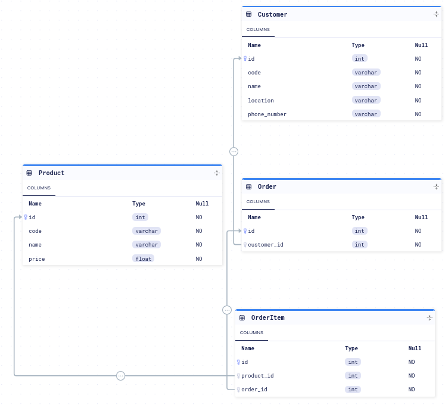

## API service
You can view the docs [here](http://137.184.154.90/docs).
Authentication is handled by `django-oauth-toolkit` that has oidc plugins. Auth is handled by the `/auth` routes. 

### Modelling
The API runs on a PGSQL DB and a Redis Instance as a backend for celery.

### Background Services
This API uses celery to handle background services like sending confirmation SMS'. Celery uses redis for queues and as a results backend.

### Error logging
Errors and endpoint performance profiles are logges on sentry.

### CI/CD
Coverage is checked on every PR and is required to be >80% for merges. Deploys are done directly to a digital ocean droplet after merge.
